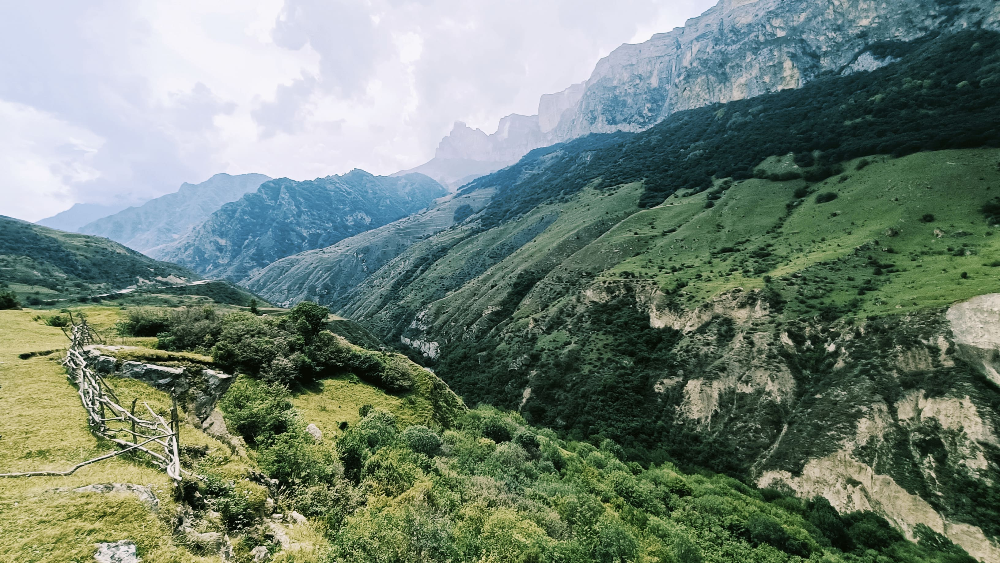

# «Путешествия по России»
___
> _Россия — это целая вселенная с ласковым морем юга, густыми лесами Саян и суровыми льдами плато Путорана._

**Путешествия по России** - это проект, который призван вдохновить вас красотами природы России. Здесь представлены и описаны некоторые интересные места, которые обязательно стоит посетить. 

___

Проект реализован с помощью **HTML** и **CSS**.
Код написан в соответствии со стандартами Яндекс Практикума в рамках учебного проекта.

**Использованы технологии:**
* Методология БЭМ:
  - классы единиц описаны по БЭМ,
  - файловая структура создана по БЭМ (Nested);
* Для создания сеток используется Flexbox и Grid;
* Созданы медиазапросы для адаптивности сайта на разных устройствах;
* Псевдоэлемент hover;
* Псевдоклассы first-child и last-childж
* Свойство transition со значением opacity для анимации ссылок;
* Позиционирование элементов;
* Работа с макетом в Figma.
___
##### [Ссылка на GitHub Pages]()